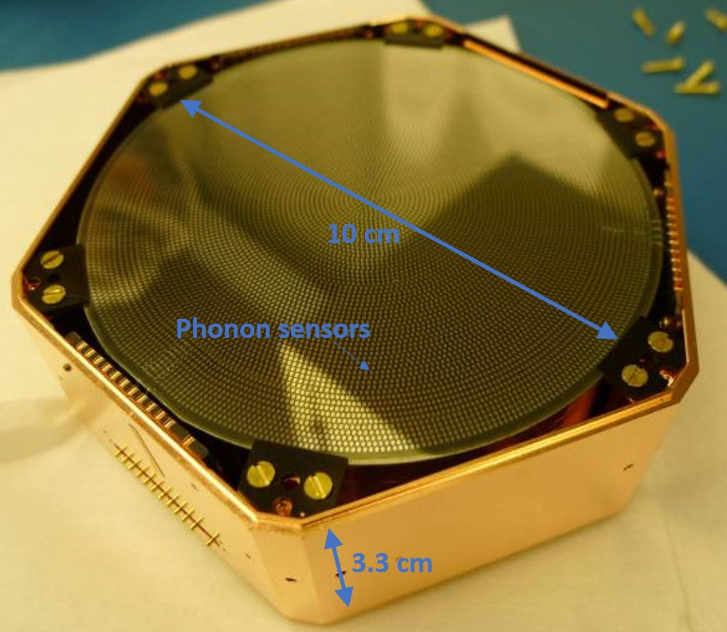
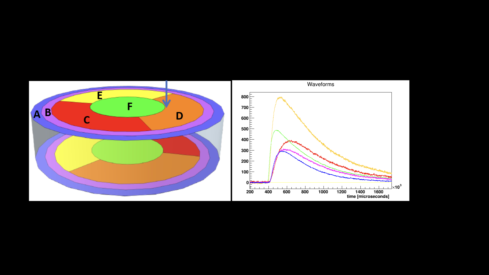

*******************
CDMS
*******************

Introduction
================

FAIR-UMN-CDMS: Identifying Interaction Location in SuperCDMS Detectors.

In this project, we address the problem of accurately reconstruct the locations of interactions in theSuperCDMS detectors using machine learning methods. The approach is to use data collected with aradioactive source at known locations to train and qualify machine learning models.

Detector and Its Data
================================

Detector Information
-----------------------------

A prototype SuperCDMS germanium detector was tested at the University of Minnesota with a radioactive source mounted on a movable stage that can scan from the edge to the center of the detector. The detector is disk-shaped with sensors placed on the top and bottom surfaces to detect the particles emitted by the radioactive source, which is shown in Figure 1:

.. centered::
	*Figure 1: A SuperCDMS dark matter detector.*

The sensors measure phonons (quantized vibrations of the crystal lattice) that are produced by the interacting particle and travel from the interaction location to the sensors. The number of phonons and the relative time of arrival at a particular sensor depends on the positions of the interaction and the sensor. The sensors are grouped into six regions on each side of the detector and each of these “channels” produces a waveform for every interaction. For the test performed at Minnesota, five channels on one side of the detector were used (Figure 2). The movable radioactive source was used to produce interactions at thirteen different locations on the detector along a radial path from the central axis to close to the the detector’s outer edge (Figure 3).

.. centered::
	*Figure 2: Pulses from an interaction in a SuperCDMS detector.*

.. image:: CDMS_images/run73_source_positions.png
   :width: 400
   :align: center

.. centered::
	*Figure 3: nteraction locations included in the dataset.*

Data from the Detector
-----------------------------

For each interaction a set of parameters was extracted from the signals from each of the five sensors. These parameters represent information known to be sensitive to interaction location, including the relative timing between pulses in different channels, and features like the pulse shape. The relative amplitudes of the pulses are also relevant but due to instabilities in amplification during the test this data is not included. The parameters included for each interaction are illustrated in Figure 4 and also see our `document <https://github.com/FAIR-UMN/FAIR-UMN-CDMS/blob/main/doc/FAIR%20Document%20-%20Identifying%20Interaction%20Location%20in%20SuperCDMS%20Detectors.pdf>`_ for details.
